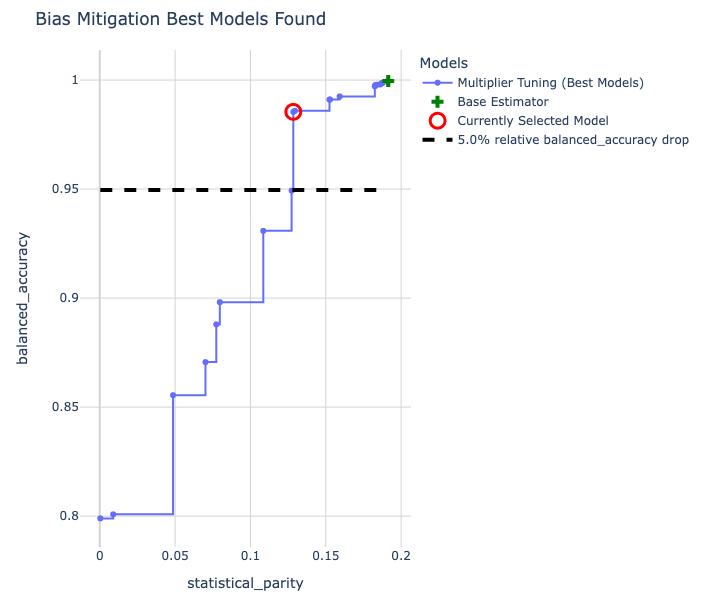
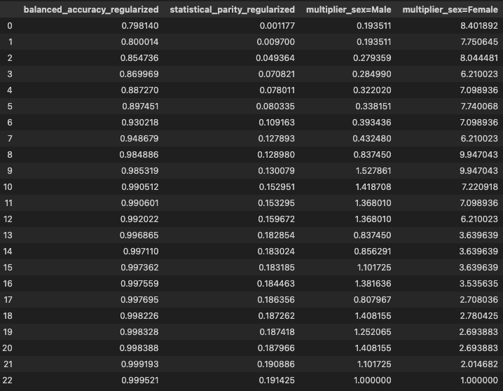

****************
Bias Mitigation
****************

**Load The Data**

.. code:: python

    from sklearn.datasets import fetch_openml
    from sklearn.model_selection import train_test_split

    dataset = fetch_openml(name='adult', as_frame=True)
    df, y = dataset.data, dataset.target

    # Several of the columns are incorrectly labeled as category type in the original dataset
    numeric_columns = ['age', 'capitalgain', 'capitalloss', 'hoursperweek']
    for col in df.columns:
        if col in numeric_columns:
            df[col] = df[col].astype(int)

    X_train, X_val, y_train, y_val = train_test_split(
        X_train, y_train, train_size=0.75, random_state=12345
    )

    X_train.shape, X_test.shap

.. parsed-literal::

    ((25641, 14), (14653, 14))

**Train a Model Using Scikit-learn**

We train a simple sklearn random forest and then evaluate its performance and fairness.

.. code:: python

    from sklearn.pipeline import Pipeline
    from sklearn.ensemble import RandomForestClassifier
    from sklearn.preprocessing import OneHotEncoder

    sklearn_model = Pipeline(
        steps=[
          ("preprocessor", OneHotEncoder(handle_unknown="ignore")),
          ("classifier", RandomForestClassifier()),
          ]
    )
    sklearn_model.fit(X_train, y_train)

We first need to initialize a ``ModelBiasMitigator``. It requires a
fitted model (the base estimator), the name of the protected
attributes to use, a fairness metric, and an accuracy metric.

.. code:: python

    from guardian_ai.fairness.bias_mitigation import ModelBiasMitigator

    bias_mitigated_model = ModelBiasMitigator(
        sklearn_model,
        protected_attribute_names="sex",
        fairness_metric="statistical_parity",
        accuracy_metric="balanced_accuracy",
    )

The ``ModelBiasMitigator`` can be called with the usual ``scikit-learn`` interface,
notably being trained with a single call to ``fit``.

.. code:: python

    bias_mitigated_model.fit(X_val, y_val)

The fitted model can then be used to collect probabilities and labels like any usual model.

.. code:: python

    bias_mitigated_model.predict_proba(X_test)

.. parsed-literal::

    array([[0.88659542, 0.11340458],
        [0.2137189 , 0.7862811 ],
        [0.3629289 , 0.6370711 ],
        ...,
        [1.        , 0.        ],
        [0.73588553, 0.26411447],
        [1.        , 0.        ]])

.. code:: python

    bias_mitigated_model.predict(X_test)

.. parsed-literal::

    array([0, 1, 1, ..., 0, 0, 0])

We can also visualize all of the best models that were found by our approach using a single ``show_tradeoff`` call.

.. code:: python

    bias_mitigated_model.show_tradeoff(hide_inadmissible=False)

A summary of these models can be accessed as below.

.. code:: python

    bias_mitigated_model.tradeoff_summary_

By default, the best model retained and used for inference is the most
fair within a 5% accuracy drop relative to the most accurate model found
by our approach. It is highlighted in red in the above figure.
Note how the base estimator without bias mitigation is dominated by a
number of models available with bias mitigation. With little to no loss
of accuracy score, we have a model that is much more fair!

If we prefer a model with a different fairness and accuracy tradeoff, we
can instead pick another model from the tradeoff plot above. The index
needed to select a model can be obtained by hovering over individual points in the plot.
We can also look up a model's index in the ``tradeoff_summary_`` DataFrame.
We can then select the model using the ``select_model`` method.

.. code:: python

    bias_mitigated_model.select_model(3)

We can run inference on with this model, just like the other one.

.. code:: python

    bias_mitigated_model.predict(X_test)

.. parsed-literal::

    array([0, 1, 1, ..., 0, 0, 0])
