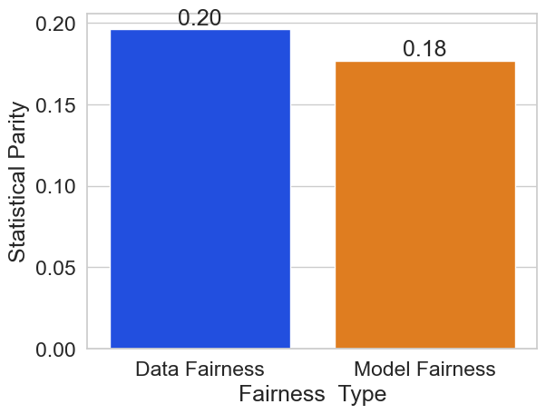

*****************
Fairness Metrics
*****************

Overview of the Fairness Metrics
================================

Oracle Guardian AI Project outlines a set of bias/fairness metrics, based on developments in the
ML fairness community [1], to assess and measure if a model/dataset complies with
a specific metric. The provided metrics all correspond to different notions of
fairness, from which the user should carefully select while taking into account
their application's context.

The metrics each implement different criteria defining how a model or dataset
should be unbiased toward a protected attribute. If an attribute is protected,
then each of its unique values (for example, “male”, “female” or “other”) are
considered subgroups that should be protected in some way so as to have equal
outcomes from the model. These types of fairness metrics are known as group fairness metrics.

We provide a table summarizing the fairness metrics in the GAI package.
Choosing the right fairness metric for a particular application is critical;
it requires domain knowledge of the complete sociotechnical system. Moreover,
different metrics bring in different perspectives and sometimes the data/model
might need to be analyzed for multiple fairness metrics. Therefore, this choice
is based on a combination of the domain, task at hand, societal impact of model
predictions, policies and regulations, legal considerations, etc. and cannot be
fully automated. However, we hope that the table below will help give some insights
into which fairness metric is best for your application.

Machine learning models that decide outcomes affecting individuals can either be
assistive or punitive. For example, a model that classifies whether or not a job
applicant should be interviewed is assistive, because the model is screening for
individuals that should receive a positive outcome. In contrast, a model that
classifies loan applicants as high risk is punitive, because the model is screening
for individuals that should receive a negative outcome. For models used in assistive
applications, it is typically important to minimize false negatives (for example, to
ensure individuals who deserve to be interviewed are interviewed), whereas in punitive
applications, it is usually important to minimize false positives (for example, to
avoid denying loans to individuals that have low credit risk). In the spirit of
fairness, one should therefore aim to minimize the disparity in false negative rates
across protected groups in assistive applications whilst minimizing the disparity in
false positive rates for punitive applications. In the following table, we have classified
each metric based on whether or not it is most appropriate for models used in assistive or
punitive applications (or both). For further explanations, please refer to this
`book <https://textbook.coleridgeinitiative.org/chap-bias.html#sec:punitiveexample>`_.

.. admonition:: Overview of the Fairness Metrics
  :class: note

  .. list-table::
    :widths: 10 10 10 10 10 50
    :header-rows: 1

    * - Metric
      - Dataset
      - Model
      - Punitive
      - Assistive
      - Perfect score means

    * - Consistency
      - ✓
      -
      - NA
      - NA
      - Neighbors (k-means) have the same Labels

    * - Smoothed EDF
      - ✓
      -
      - NA
      - NA
      - Sub-populations have equal probability of positive label (with log scaling of deviation)

    * - Statistical Parity
      - ✓
      - ✓
      - ✓
      -
      - Sub-populations have equal probability of positive prediction

    * - True Positive Rates
      -
      - ✓
      -
      - ✓
      - Sub-populations have equal probability of positive prediction when their true label is positive

    * - False Positive Rates
      -
      - ✓
      - ✓
      -
      - Sub-populations have equal probability of positive prediction when their true label is negative

    * - False Negative Rates
      -
      - ✓
      -
      - ✓
      - Sub-populations have equal probability of negative prediction when their true label is positive

    * - False Omission Rates
      -
      - ✓
      -
      - ✓
      - Sub-populations have equal probability of a positive true label when their prediction is negative

    * - False Discovery Rates
      -
      - ✓
      - ✓
      -
      - Sub-populations have equal probability of a negative true label when their prediction is positive

    * - Equalized Odds
      -
      - ✓
      - ✓
      - ✓
      - Sub-populations have equal true positive rate and equal false positive rate

    * - Error Rates
      -
      - ✓
      -
      - ✓
      - Sub-populations have equal probability of a false prediction

    * - Theil Index
      -
      - ✓
      -
      - ✓
      - Error rates are the same for sub-populations and whole population (deviations are measured using entropy)

[1] `Moritz Hardt et al. "Fairness and Machine Learning: Limitations and
Opportunities". 2019. <https://fairmlbook.org/>`_

For maximal versatility, all supported metrics are offered under two formats:

#. A scikit-learn-like ``Scorer`` object which can be initialized and reused to test different models or datasets.
#. A functional interface that can easily be used for one-line computations.

Unintended Bias Detection
=========================

The ``guardian_ai.fairness.metrics`` module
provides metrics dedicated to assessing and checking whether the model
predictions and/or true labels in data comply with a particular fairness
metric. For this example, we will take a look at the statistical parity
metric. This metric, also known as demographic parity, measures how much
a protected group’s outcome varies when compared to the rest of the
subgroups. Thus, such fairness metrics denote differences in error
rates for different demographic groups/protected attributes in data.
Therefore, these metrics are to be **minimized** to decrease
discrepancies in model predictions with respect to specific groups of
people. Traditional classification metrics such as accuracy, on the
other hand, are to be maximized.

Measure the Compliance of a Model with a Fairness Metric
--------------------------------------------------------

In the
context of the Adult Census Income dataset, if we want to measure
fairness with respect to the ``sex`` attribute, statistical parity
corresponds to the disparity between the model’s rate of predicting a
``>50k`` income between men and women. Model fairness metrics are
available as scikit-learn compatible scorers, taking in a list of
``protected_attributes`` at creation and then being called with a
``model``, ``X``, and ``y`` on which to measure fairness. By default, the
fairness metric will measure the *difference* between a subgroup’s
outcome and that of the rest of the subgroups, returning the *mean*
disparity over all subgroups. These two options can be changed at the
creation of the metric, using the ``distance_measure`` and ``reduction``
arguments, respectively.

**Load The Data**

.. code:: python

    from sklearn.datasets import fetch_openml
    from sklearn.model_selection import train_test_split

    dataset = fetch_openml(name='adult', as_frame=True)
    df, y = dataset.data, dataset.target

    # Several of the columns are incorrectly labeled as category type in the original dataset
    numeric_columns = ['age', 'capitalgain', 'capitalloss', 'hoursperweek']
    for col in df.columns:
        if col in numeric_columns:
            df[col] = df[col].astype(int)

    X_train, X_test, y_train, y_test = train_test_split(df,
                                                        y.map({'>50K': 1, '<=50K': 0}).astype(int),
                                                        train_size=0.7,
                                                        random_state=0)

    X_train.shape, X_test.shap

.. parsed-literal::

    ((34189, 14), (14653, 14))

**Train a Model Using Scikit-learn**

We first train a simple sklearn
random forest and then evaluate its performance and fairness.

.. code:: python

    from sklearn.pipeline import Pipeline
    from sklearn.ensemble import RandomForestClassifier
    from sklearn.preprocessing import OneHotEncoder

    sklearn_model = Pipeline(
        steps=[
          ("preprocessor", OneHotEncoder(handle_unknown="ignore")),
          ("classifier", RandomForestClassifier()),
          ]
    )
    sklearn_model.fit(X_train, y_train)

We use the ``roc_auc_score`` scoring metric to evaluate the performance
of this model on unseen data (``X_test``).

.. code:: python

    from sklearn.metrics import roc_auc_score

    y_proba = sklearn_model.predict_proba(X_test)
    score = roc_auc_score(y_test, y_proba[:, 1])

    print(f'Score on test data: {score:.2f}')

.. parsed-literal::

    Score on test data: 0.90

Now, we can also compute the statistical parity of the model on test
data.

.. code:: python

    from guardian_ai.fairness.metrics import ModelStatisticalParityScorer

    fairness_score = ModelStatisticalParityScorer(protected_attributes='sex')
    parity_test = fairness_score(sklearn_model, X_test)
    print(f'Statistical parity of the model (lower is better): {parity_test:.2f}')

.. parsed-literal::

    Statistical parity of the model (lower is better): 0.18

Measure the Compliance of the True Labels of a Dataset with a Fairness Metric
-----------------------------------------------------------------------------

Given a dataset with some ground truth labels, we can
check whether those true labels satisfy a particular fairness metric of
concern. In this context, statistical parity measures the disparity of
positive label rates between subgroups and the rest of the subgroups.
Dataset fairness metrics are available as scikit-learn compatible
scorers, taking in a list of ``protected_attributes`` at creation and
then being called with a ``model``, ``X`` and ``y`` on which to measure
fairness, with ``model`` being an ignored and optional argument.

.. code:: python

    from guardian_ai.fairness.metrics import DatasetStatisticalParityScorer

    DSPS = DatasetStatisticalParityScorer(protected_attributes='sex')

    parity_test_data = DSPS(X=X_test, y_true=y_test)

Dataset fairness metrics are also available as functions taking as
inputs ``y_true`` and ``subgroups``.

.. code:: python

    from guardian_ai.fairness.metrics import dataset_statistical_parity

    subgroups = X_test[['sex']]

    parity_test_data = dataset_statistical_parity(y_test, subgroups)
    print(f'Statistical parity of the test data (lower is better): {parity_test_data:.2f}')

.. parsed-literal::

    Statistical parity of the test data (lower is better): 0.20

We can see here that the test set of the Adult Census Income Dataset has
a statistical parity with respect to sex of ``0.20``, meaning that men
have 20% more ``>50k`` labels than women. Interestingly, the dataset’s
statistical disparity (``0.20``) is less than the tuned model’s
(``0.33``), highlighting that a trained model can amplify the unintended
bias that is contained in the dataset.

.. code:: python

    ax = sns.barplot(
            x='Fairness  Type',
            y='Statistical Parity',
            data=pd.DataFrame({
                'Fairness  Type': ['Data Fairness', 'Model Fairness'],
                'Statistical Parity': [parity_test_data, parity_test_sklearn_model],
            })
    )
    ax.bar_label(ax.containers[0], fmt='%.2f')

.. parsed-literal::

    [Text(0, 0, '0.20'), Text(0, 0, '0.18')]

Other Fairness Metrics
----------------------

Statistical parity is only one of the many
supported fairness metrics. As another example, we can compute Equalized
Odds, which measures the disparity of a model’s true positive and false
positive rates between different subgroups of the data based on
demographic information/protected attributes.

.. code:: python

    from guardian_ai.fairness.metrics import EqualizedOddsScorer

    fairness_score = EqualizedOddsScorer(protected_attributes='sex', distance_measure='diff')
    EO_original = fairness_score(sklearn_model, X_test, y_test)
    print(f'Equalized odds on test data (lower is better): {EO_original:.2f}')

.. parsed-literal::

    Equalized odds on test data (lower is better): 0.12

We can also easily compute these fairness metrics on more than one
protected attribute.

.. code:: python

    fairness_score = EqualizedOddsScorer(protected_attributes=['sex', 'race'], distance_measure='diff')
    EO = fairness_score(sklearn_model, X_test, y_test)
    print(f'Equalized odds on test data (lower is better): {EO:.2f}')

.. parsed-literal::

    Equalized odds on test data (lower is better): 0.20

Note that, unlike statistical parity, we cannot compute equalized odds
on the dataset since it is dependent to model output. However, we can
compute other metrics on the dataset like ``Smoothed EDF``; it is
computed as the minimal exponential deviation of positive target ratios
comparing a subgroup to the rest of the subgroups.

.. code:: python

    from guardian_ai.fairness.metrics import smoothed_edf

    subgroups = X_train[['race', 'sex']]
    smoothed_edf_score = smoothed_edf(y_train, subgroups)
    print(f'Smoothed EDF score on train data: {smoothed_edf_score:.2f}')

.. parsed-literal::

    Smoothed EDF score on train data: 1.71
